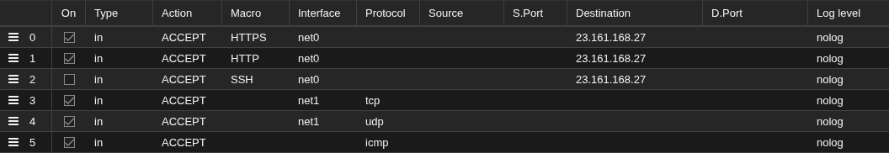

# OPNsense-Setup


## Virtual bridge

Node name -> Network -> Create a second virtual bridge with IP address 192.168.1.2. Check on "VLAN aware".


## Create OPNsense VM

Create OPNsense VM as usual, note that:
- OPNsense is FreeBSD, not Linux, so mark the OS as "other".
- OPNsense supports QEMU guest agent, so make sure that checkbox is ticked.
- OPNsense does not support Secure Boot, so uncheck pre-enrolled keys for system settings.
- Use vmbr0 for networking.
- Do not start the VM after creation.


## Network & Firewalling

- VM name -> Hardware -> Add a second network interface bridging to the new virtual bridge.


- VM name -> Firewall -> IPset
    - Create ipfilter-net0 -> Add all public IP addresses OPNsense is supposed to handle (Basically, all public IPs except those of iDRAC and Proxmox).
    - Create ipfilter-net1 -> 192.168.1.1, 192.168.2.1.

- VM name -> Firewall -> Add approprieate firewall rules



**Note**: These firewall rules will stop VMs behind OPNsense from *initiating* any non TCP, UDP, and ICMP connections. Do not use the Ping macro, as it will break ping from the VMs behind OPNsense.

- VM Firewall -> Options
    - Enable Firewall, Router Advertisement, and IP filter
    - Disable DHCP

## OPNSense installation

Install OPNsense as usual, note that:
- Use UFS as the filesystem, as the VM itself already runs inside of a ZVOL.
- Go without swap on SSD.
- The default password for both the root and installer user is "opnsense".

## Configure interfaces

- Open console and configure interfaces. Note that by default OPNsense sets net0 as "LAN" and net1 as "WAN", which is the opposite of what we want.
- Open shell and run `pfctl -d` to temporarily disable the packet filter.
- Add the following rules to make sure the web interface is reachable on WAN:


## Configure OPNsense

- System -> Firmware
    - Updates -> Check for updates
    - Plugins -> Install the following (skip os-intrusion-detection-content-ptopen and os-intrusion-detection-content-snort-vrt - the rulesets are not maintained):
        - os-acme-client
        - os-chrony
        - os-crowdsec
        - os-etpro-telemetry
        - os-intrusion-detection-content-et-open
        - os-qemu-guest-agent, os-sunnyvalley
        - os-theme-vincuna
    - Refresh plugins -> Install os-sensei
    - Reboot

- Services -> ACME Client
    - Settings -> Settings
        - Enable plugin
        - Uncheck Show introduction pages
    - Accounts -> Register an account. 
    - Update CAA records with your DNS provider. The account info is stored in `/var/etc/acme-client/accounts`/
    - Challenge Types -> Add challenge
    - Certificates -> Add certificates (EC-256) 

- System -> Settings -> Administration
    - Change SSL certificate to one issued by ACME
    - SSL Ciphers -> Restrict to this suite: ECDHE-ECDSA-AES256-GCM-SHA384:ECDHE-ECDSA-CHACHA20-POLY1305:ECDHE-ECDSA-AES128-GCM-SHA256;
    - HTTP Strict Transport Security -> Enable
    - Primary Console -> Serial Console
    - Secondary Console -> VGA Console
    - Uncheck "Password protect the console menu"

- System -> Settings -> Cron
    - Add the following:
    

- System -> Settings -> General
    - Domain -> Set approprieate domain name
    - Theme -> vincuna
    - DNS servers -> Set appropriate DNS servers
    - DNS search domain -> Set appropriate DNS search domain
    - DNS server options -> Uncheck "Allow DNS server list to be overridden by DHCP/PPP on WAN"

- System -> Access
    - Users
        - Open the root user and add the OTP seed to your phone
    - Servers
        - Follow [this guide](https://docs.opnsense.org/manual/how-tos/two_factor.html) to add the TOTP server and use it for Auth. Consider reversing the token order.

- System -> Trust -> Certificates
    - Delete the self-signed "Web GUI TLS certificate" which is no longer necessary

- System -> Trust -> Settings
    - Check "Store CRL's"
    - Check "Auto fetch CRL's"
    - Uncheck "Enable legacy"

- Interfaces -> LAN
    - Check "Block bogon networks"
    - Set IP address as 192.168.1.1/24

- Interfaces -> Devices -> VLAN -> Add new VLAN
    - Device -> vlan02
    - Parent -> vtnet1 [LAN]
    - VLAN tag -> 2

- Interfaces -> Assignment
    - Add vlan02 with description VLAN02

- Interfaces -> VLAN02
    - Check "Enable interface"
    - Check "Block bogon networks"
    - Set IP address as 192.168.2.1/24

- Interfaces -> Virtual IPs
    - Settings -> Add other WAN IPs (Except iDRAC, Proxmox, and OPNsense's own IP), deny service binding
    - Status -> Temporarily Disable CARP

- Firewall -> Rules -> VLAN02 -> Add
    - Action: Pass
    - Direction: In
    - TCP/IP Version: IPv4 + IPv6

- Firewall -> NAT -> Port Forward -> New Rule
    - Interface: LAN
    - TCP/IP Version: IPv4
    - Protocol: TCP/UDP
    - Check "Destination / Invert"
    - Destination: LAN address
    - Destination port range: from DNS to DNS
    - Redirect target IP: 127.0.0.1
    - Redirect target port: DNS

- Firewall -> NAT -> Port Forward -> Clone the previous rule
    - TCP/IP Version: IPv6
    - Redirect target IP: ::1

- Firewall -> NAT -> Port Forward -> Clone the previous rule
    - Interface: VLAN02
    - TCP/IP Version: IPv4
    - Redirect target IP: 127.0.0.1

- Firewall -> NAT -> Port Forward -> Clone the previous rule
    - TCP/IP Version: IPv6
    - Redirect target IP: ::1

- Firewall -> Settings
    - Advanced
        - Check "Reflection for port forwards"
        - Check "Reflection for 1:1"
        - Check "Automatic outbout NAT for reflection"
        - Bogon Networks -> Update Frequency -> Daily
        - Check "Disable administration anti-lockout rule"
        - Check "Verify HTTPS certificates when downloading alias URLs"
        - **Notes:** Do NOT enable syncookies, it breaks connections to certain services

- Services -> Chrony
    - Check "Enable"
    - Check "NTS Client Support"
    - Allowed Networks -> Remove 0.opnsense.pool.ntp.org, add 10.0.0.0/8, 172.16.0.0/12, 192.168.0.0/16, and fc00::/7.

- Services -> CrowdSec
    - Make sure Enable Log Processor, Enable LAPI, Enable Remediation, and Create Blocklist rules are all checked
    - Enrollment key from https://app.crowdsec.net -> Enter key received from CrowdSec
    - Whitelist good actors (need shell access):

```sh
cscli collections install crowdsecurity/whitelist-good-actors
cscli parsers install crowdsecurity/whitelists
```
    - Check "Enable log for rules"

- Services -> Dnsmasq DNS & DHCP
    - Not actually gonna use this, but check "DNSSEC" anyways.

- Services -> Intrusion Detection
    - Downloads
        - Add et_telemetry.token. Hit "Save".
        - Enable the following rules (we are mixing ET open and ET telemtry because of [this issue](os-intrusion-detection-content-et-open)):
            - abuse.ch/SSL Fingerprint Blacklist
            - ET open/botcc
            - ET open/botcc.portgrouped
            - ET open/compromised
            - ET open/dshield
            - ET open/emerging-icmp
            - ET open/emerging-shellcode
            - ET telemetry/emerging-attack_response
            - ET telemetry/emerging-coinminer
            - ET telemetry/emerging-current_events
            - ET telemetry/emerging-exploit
            - ET telemetry/emerging-exploit_kit
            - ET telemetry/emerging-p2p (Don't wanna get DMCAed here)
            - ET telemetry/emerging-web_server
        - Download and update rules
    - Settings
        - Check "Enabled"
        - IPS Mode -> Click on the link to go to advanced network and disable hardware offloading first, then check "IPS Mode"
        - Check "Promiscuous mode"
        - Pattern Matcher -> Hyperscan
        - Detect Profile -> High
        - Interfaces -> LAN
        - Home Networks -> Add fc00::/7
    - Policy -> Create new policy
        - Priority 0
        - Rulesets -> All
        - Actions -> Alert
        - New action -> Drop
        - Description -> Drop All
    - Administration
        - Check "Enabled"
        - Check "IPS Mode"
        - Home Networks (if you don't see it, make sure advanced options are enabled) -> Clear all IPs, add WAN IP and virtual IPs

- Services -> Network Time
    - General -> Remove all NTP servers (We already have Chrony, we don't need ntpd to be running)

- Services -> Unbound DNS
    - General
        - Check "Enable DNSSEC Support"
    - Advanced
        - Check "Hide Identity"
        - Check "Hide Version"
        - Check "Prefetch DNS Key Support"
        - Check "Harden DNSSEC Data"
        - Check "Strict QNAME Minimisation"
        - Check "Prefetch Support"
    - Blocklist
        - Check "Enable"
        - Type of DNSBL
            - Abuse.ch Threatfox IOC Database
            - AdAway List
            - AdGuard List
            - Blocklist.site Abuse
            - Blocklist.site Fraud
            - Blocklist.site Gambling
            - Blocklist.site Malware
            - Blocklist.site Phishing
            - Blocklist.site Ransomware
            - Blocklist.site Scam
            - EasyList
            - Easy Privacy
            - hagezi Fake-scams/fakes
            - hagezi Pop-Up Ads
            - hagezi Threat Inelligence Feeds
            - hagezi Gambling
            - OISD Domain Blocklist Ads
    - DNS over TLS
        - Add Cloudflare Secure Gateway. Use `dig A your-endpoint.cloudflare-gateway.com` and `dig AAAA your-endpoint.cloudflare-gateway.com` to get the IP addresses to pin. Check `Forward first`.
        - This is my current policies. Note that "parked domains" is not blocked because that category has false positives.


- Reporting
    - Settings
        - Unbound DNS reporting -> Check "Enables local gathering of statistics."

- ZenArmor
    - Go through the installation wizard
        - Use Elasticsearch 8
        - Monitor the VLAN02 interface, set security zone as "lan"
    - Policies -> Default
        - Security -> Enable "Malware/Virus" and "Phishing". I have previously run into false positives with "Spam sites, Potentially Dangerous", and "Parked Domains"
        - Content Inspection -> Change all options in "DNS Deep Inspection" to "Block"
        - App Control -> Block "Ad Tracker" and "Ads"
        - Exclusions -> Disable Feedbacks
    - Settings
        - Reporting & Data
            - Community ID -> Disable
        - Cloud Threat Intelligence
            - Local Domains Name To Exclude From Cloud Queries -> Remove default 
        - Privacy
            - Help us improve ZenArmor -> Disable
            - Report Infrastructure Errors -> Disable

## Use as Proxmox's DNS server

Go to Proxmox -> Node Name -> System -> DNS
- Set the primary DNS server as 192.168.1.1
- Set 1.1.1.2 and 2606:4700:4700::1112
